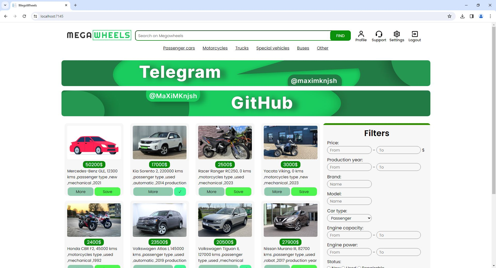
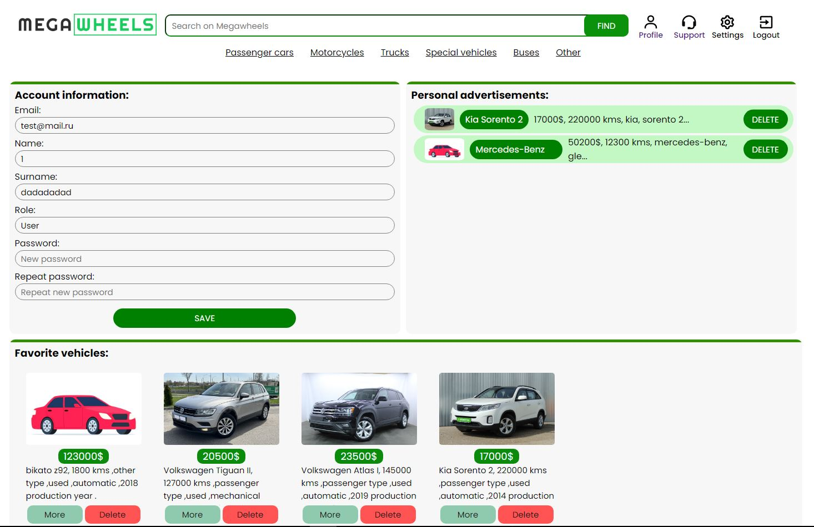
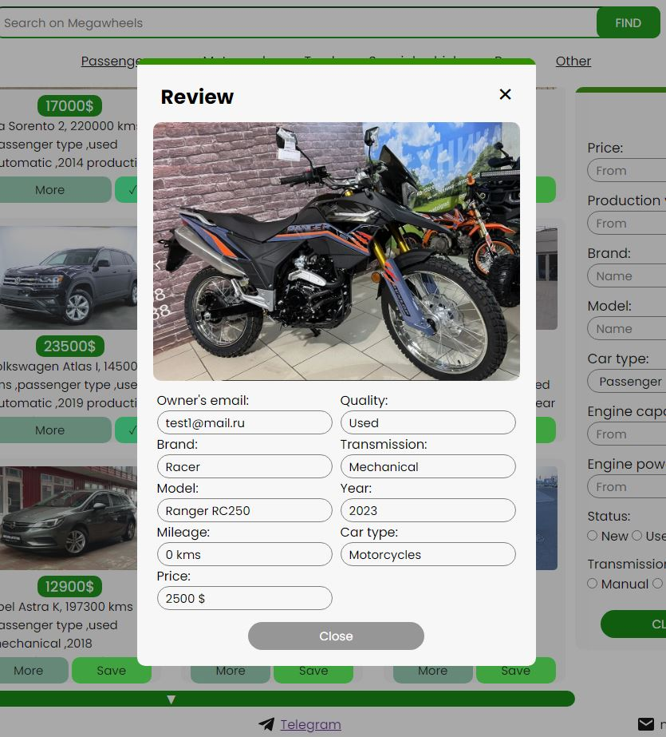
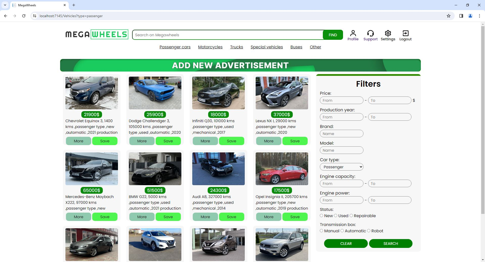
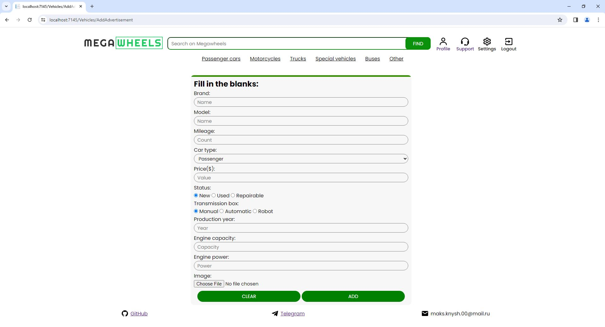
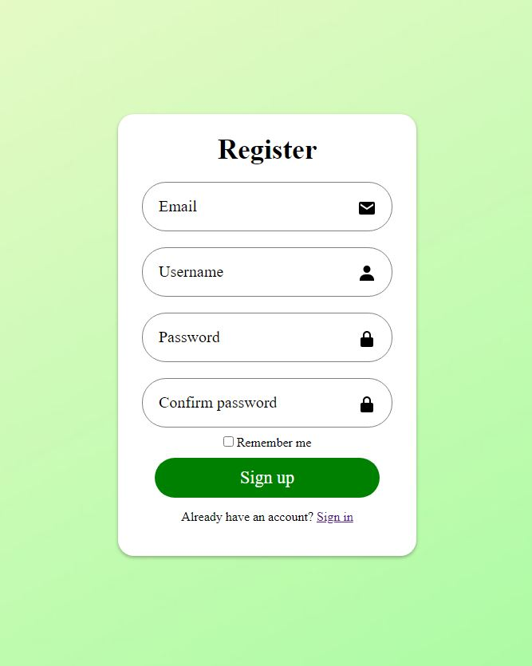

<h1 align="center">Hi there!✌️</h1>
<h3 align="center">This is a Web MVC app developed as a pet project.</h3>
<h2 align="center">🔥Keywords: ASP.Net Core Web MVC, JWT/RT tokens, MsSQL, EF, HTML, CSS</h2>
<h3 align="center">The web application is developed using ASP .Net Core Web MVC technology in order to gain experience and realize a pet project. The functionality is an electronic vehicles shop for sellers and buyers.</h3>

  <h3>The result of the decision:</h3>
  
  
  
  
  
  

